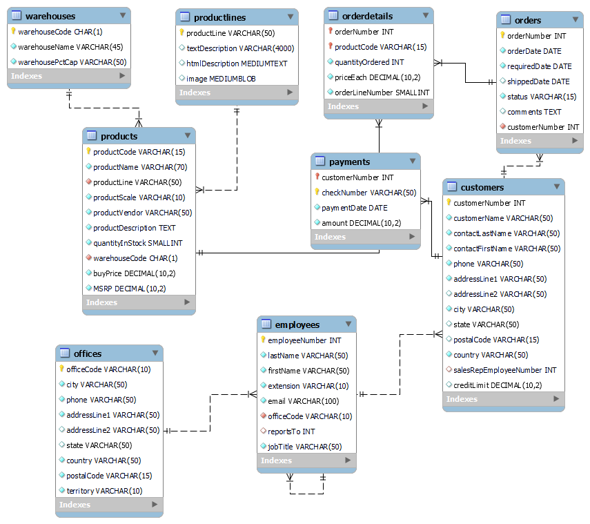
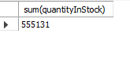
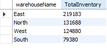
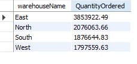
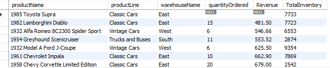
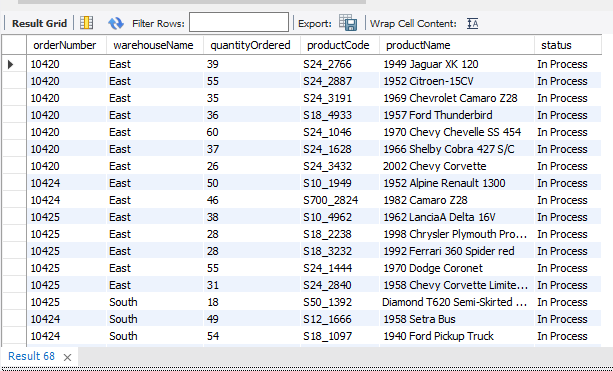

# Mintclassics

## INTRODUCTION
I have recently taken on the role of an entry-level data analyst at the Mint Classics Company. My responsibilities involve analyzing data within a relational database to support business decisions related to inventory management, ultimately contributing to the closure of a storage facility.
The Dataset was gotten from Coursera Project work [here](https://www.coursera.org/learn/showcase-analyze-data-model-car-database-mysql-workbench/supplement/uKwPr/the-project-scenario)

## Problem Statement
Mint Classics Company, a retailer of classic model cars and other vehicles, is looking at closing one of their storage facilities.To support a data-based business decision, they are looking for suggestions and recommendations for reorganizing or reducing inventory, while still maintaining timely service to their customers.

## Questions:
1. The total inventory.
2. The total inventory and order quantity in each warehouse
3. The total revenue generated from each warehouse
4. Conduct a product analysis to identify items in storage with low movement.
5. Identify products in the processing stage to prioritize shipment before deciding on warehouse closure.
6. which months had the highest revenue

## Data Understanding
In this section, I will present the database structure of Mint Classics Company through an EER (Extended Entity-Relationship) Diagram.

In the above diagram, the dataset consists of 9 tables, 
1. Poducts table: This table consists of the product types, Order quantities, Pices, product description and so on. 
2. Product Lines: Gather information regarding the descriptions of every product line offered for sale by the company.
3. Customers: It gathers inormtion on the company customers proile such as names, address, credtit limit and so on.
4. Payments: This table consists of payments made by customers
5. Warehouse: It include the company warehouses used to store the products
6. Orders: it consists of customers orders for speciic products
7. Order Details: It gathers data about others for specific products.
8. Ofice: It includes data on the different branches and the location.
9. Employees: It gahters data on the company employees which include; names, address, ofices and so on

After studying the EER diagram, th following tables are used to solve the business problem:
1. warehouses
2. products
3. productlines
4. orders
5. orderdetails

## Analysis
I conducted an analysis by examining the overall stock quantities in the company for each warehouse, by looking at the warehouse with the most stock.

Then i checked for the warehouse that generated the most revenue

The East, North and South generated more revnue than the west warehouse. Subsequently, I examined products in storage that showed no movement. Specifically, the product named 'Toyota Supra' did not contribute any revenue to the company and the management needs to look into this.

Additionally, I observed that the status of certain orders is still marked as 'In Process.' It is crucial to process these orders before making any decisions regarding warehouse closures.

Any considerations of warehouse closure should be temporarily deferred until these outstanding orders are completed to ensure a smooth transition.
The final quarter of the year experiences the highest activity, making it the busiest period. To stimulate additional sales and facilitate the clearance of inventory, there is an option to consider reducing product prices during this time.

## Summary
In my overall assessment, it appears reasonable to consider closing the West warehouse. However, I acknowledge that this analysis may not be exhaustive, and there are additional factors that I believe should be taken into consideration before making a final decision.

link to my code [here](https://github.com/Bessdatahub/Mintclassics/blob/main/mintdb.mwb)

